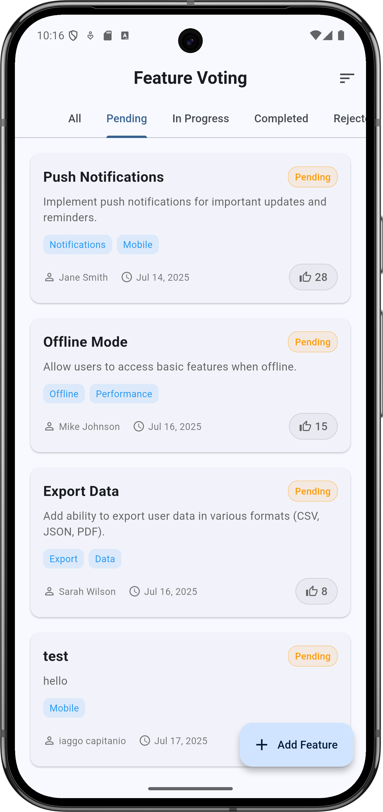
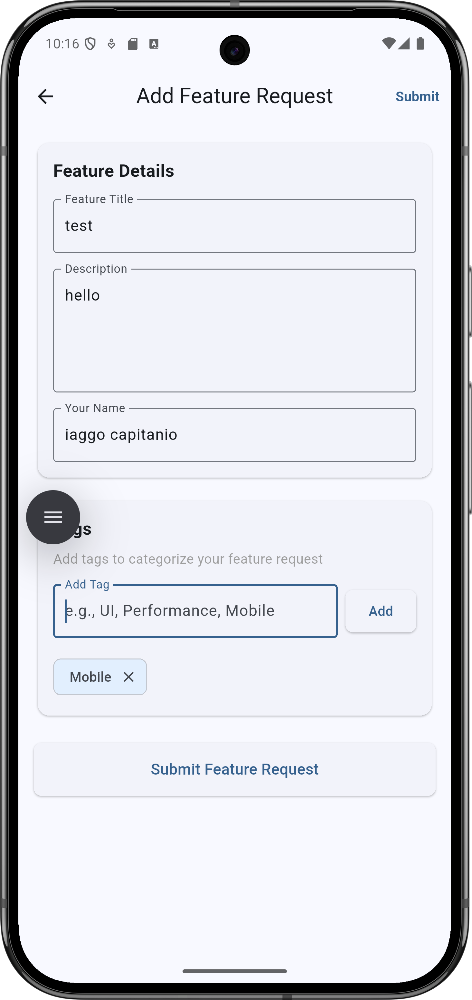

# 🗳️ Feature Voting System

A Flutter application built with **Clean Architecture** principles that allows users to submit, vote on, and manage feature requests. The app demonstrates modern Flutter development practices with proper separation of concerns, state management, and persistent storage.


# Home Page

# Add Page 

## 📱 Features

### Core Functionality
- ✅ **Submit Feature Requests** - Users can create new feature requests with descriptions and tags
- ✅ **Vote on Features** - Upvote/downvote features with real-time vote counting
- ✅ **Feature Management** - Filter by status (Pending, In Progress, Completed, Rejected)
- ✅ **Sorting Options** - Sort by votes or creation date
- ✅ **Tag System** - Categorize features with custom tags
- ✅ **Persistent Storage** - SQLite database for offline functionality

### Technical Features
- 🏗️ **Clean Architecture** - Proper separation of concerns with Domain, Data, and Presentation layers
- 🔄 **State Management** - BLoC/Cubit pattern for predictable state management
- 💉 **Dependency Injection** - GetIt for dependency management
- 🗄️ **Local Database** - SQLite for persistent data storage
- 📱 **Responsive Design** - Material Design 3 with adaptive layouts
- ⚡ **Optimistic Updates** - Immediate UI feedback for better UX

## 🏗️ Architecture

This project follows **Clean Architecture** principles with clear separation between layers:

```
lib/
├── core/                           # Core utilities and shared components
│   ├── database/                   # Database configuration and helpers
│   │   ├── database_helper.dart    # SQLite database operations
│   │   └── database_manager.dart   # Database management utilities
│   └── usecases/                   # Base use case interface
│       └── usecase.dart
├── features/
│   └── voting/                     # Feature voting module
│       ├── domain/                 # Business Logic Layer
│       │   ├── entities/           # Business objects
│       │   │   └── feature.dart
│       │   ├── repositories/       # Repository interfaces
│       │   │   └── feature_repository.dart
│       │   └── usecases/          # Business rules
│       │       ├── add_feature.dart
│       │       ├── get_features.dart
│       │       └── vote_feature.dart
│       ├── data/                   # Data Access Layer
│       │   ├── datasources/        # Data source abstractions
│       │   │   └── feature_local_data_source.dart
│       │   ├── models/             # Data models
│       │   │   └── feature_model.dart
│       │   └── repositories/       # Repository implementations
│       │       └── feature_repository_impl.dart
│       └── presentation/           # Presentation Layer
│           ├── cubits/             # State management
│           │   ├── feature_cubit.dart
│           │   └── feature_state.dart
│           ├── pages/              # UI screens
│           │   ├── home/
│           │   │   └── home_page.dart
│           │   └── add_feature/
│           │       └── add_feature_page.dart
│           └── widgets/            # Reusable UI components
│               └── feature_card.dart
├── service_locator.dart            # Dependency injection setup
└── main.dart                       # App entry point
```

## 🚀 Getting Started

### Prerequisites

- Flutter SDK (>=3.0.0)
- Dart SDK (>=3.0.0)
- Android Studio / VS Code
- Git

### Installation

1. **Clone the repository**
   ```bash
   git clone https://github.com/yourusername/feature-voting-flutter.git
   cd feature-voting-flutter